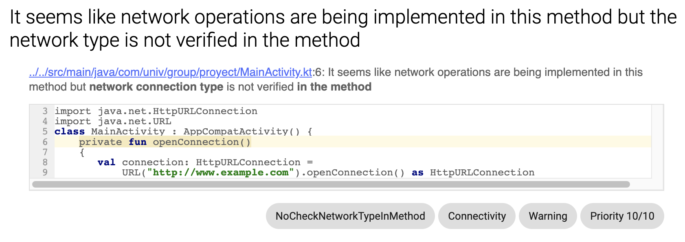
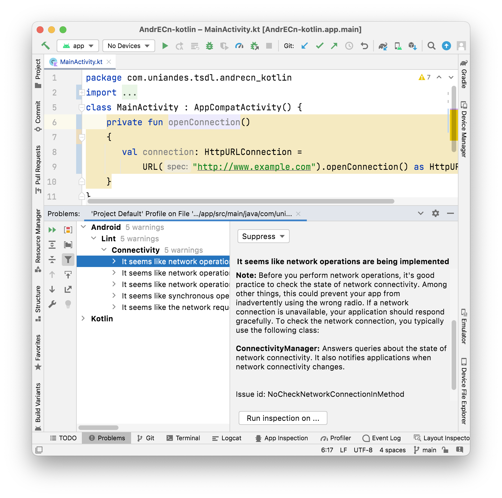
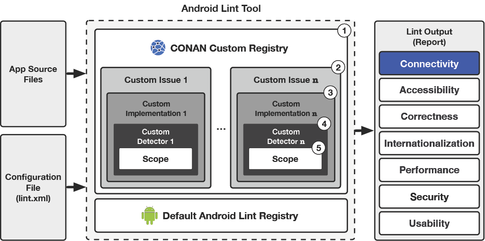

# Purpose

This project was created by the SoftwarE Analytics Research Team (SEART) at Università della Svizzera italiana and The Sofware Design Lab (TSDL) at the Universidad de los Andes. The major goal of the CONAN project is to enable automatic detection of **CON**nectivity issues in **AN**droid apps. Unlike current approaches, CONAN is based on static analysis mechanisms, thus enabling practitioners to identify potential connectivity issues in the early development stages, since all it requires is the source code of the application to analyze.

# Video

<iframe width="500" height="282" src="https://www.youtube.com/embed/LBBvXdjftVU" frameborder="0" allow="accelerometer; autoplay; encrypted-media; gyroscope; picture-in-picture" allowfullscreen></iframe>

# Publications

- _"Studying eventual connectivity issues in Android apps."_, Escobar-Velásquez, Camilo and Mazuera-Rozo, Alejandro and Bedoya, Claudia and Osorio-Riaño, Michael and Linares-Vásquez, Mario and Bavota, Gabriele, _In Empirical Software Engineering 2022_, Journal Article [[DOI](https://doi.org/10.1007/s10664-021-10020-6)] [[Online Appendix](https://thesoftwaredesignlab.github.io/android-eventual-connectivity/)] 
- _"Detecting Connectivity Issues in Android Apps."_, Mazuera-Rozo, Alejandro and Escobar-Velásquez, Camilo and Espitia-Acero, Juan and Linares-Vásquez, Mario and Bavota, Gabriele, _In Proceedings of the 29th IEEE International Conference on Software Analysis, Evolution and Reengineering 2022 (SANER’22)_, Research Track Track [[DOI](https://doi.org/10.1109/SANER53432.2022.00087)]

# CONAN in action

A JAR file containing our set of Linter rules has been generated for users to try CONAN, it is available in the following [link]().

The developer should identify the folder containing the main module of the application of interest (_i.e.,_ normally this folder is called `app`). CONAN's JAR must be placed inside the subdirectory `app/libs`. If the `libs` folder does not exist inside `app`, it must be created. Android Lint is IDE-independent, which means it can be run from the command line as follows: `./gradlew :app:lint`. After execution, a report is generated; CONAN adopts the same output format of Android Lint describing the identified _connectivity issues_ in a structured HTML file. For each identified issue CONAN provides the snippet of code in which it has been identified marking its category as _connectivity issues_. Fig. 1 depicts an example of a report presenting an issue in which a _NT_ is being performed but the network type is not being validated. 

Moreover, once the JAR file has been included in the project, CONAN can also be used directly in Android Studio. Besides issues being directly highlighted in the editor, a developer can trigger our set of Linter rules by pressing _Inspect Code..._ in the _Code_ menu. Fig. 2 depicts inspection results in the `Problem` panel, presenting the developer a list of _connectivity issues_ as well as their description.

# CONAN Architecture Overview

Fig. 1 depicts CONAN integration in Android Lint. Overall, Lint's open-closed model allows for the addition of custom checks. Given the set of Java classes defining Android lint internals (___i.e.,___ `com.android.tools.lint`), the main idea behind building customized checks is fundamentally to define custom issues (2) (`Issue::class`) (__i.e.,__ potential bug in an Android application), and declare them in a custom registry(1) (`IssueRegistry::class`) (__i.e.,__ registry which provides a list of checks to be performed on an Android project). Each issue needs to be _**mapped**_ to a custom detector(4) (`Detector::class`) responsible for analyzing the issue as well as its (5) (`Scope::class`), meaning the set of type of files (_e.g.,_ Java files) a detector must consider when performing its analysis. Such a _mapping_ relation is performed by defining a custom Implementation(3) (`Implementation::class`).

## (1) Registry:
A _Registry_ is a list of _Issues_ that Lint addresses given a JAR of Lint rules. The default list of _Issues_ being checked is included in the `BuiltinIssueRegistry` class. Therefore, the inclusion of custom _Issues_ requires the provision of a custom _Registry_, which will be packaged inside the resulting JAR file when publishing custom lint checks, and will point to the newly provided _Issues_

## (2) Issue:
An _Issue_ represents a potential bug in an application that Lint should check, each issue has associated metadata such as:  ID, description, severity (_e.g.,_ `WARNING`), priority (_i.e.,_ 1-10), explanation, and a category (_e.g.,_ _Connectivity_). By convention, issues are registered inside the companion object of the corresponding detector.

## (3) Implementation:
The _Implementation_ is the component of an _Issue} containing information about how a given _Issue} is actually analyzed, such as which _Detector} class to instantiate and which _Scopes} the detector covers.

## (4) Detector:
A _Detector_ is the element scanning through code to find and report _Issue_ instances. Detectors can identify and report multiple _Issue_ types. A _Detector_ implements one of the `Scanner` interfaces in order to scan code (_i.e.,_ `XmlScanner`, `JavaScanner`, and `ClassScanner`, used for XML files, Java & Kotlin files, and class files, respectively). The scanners traverse the UAST, thus accessing to specific pieces of code related to our _Issues_.

## (5) Scope:
A _Scope_ is an `enum` listing various types of files that a _Detector_ may analyze, since an _Issue_ can be present in said files. Possible options include resource files and Java source files. For instance, if the _Issue_ is framed in the Android Manifest, the `Scope.MANIFEST_SCOPE` should be set.

    
---
Hosted on GitHub Pages - Theme by [orderedlist](https://github.com/orderedlist)
